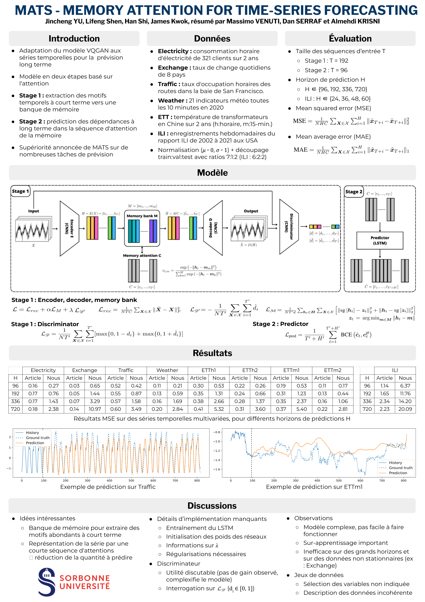

# Non official implementation of MATS - Memory Attention for Time Series forecasting

A new model, Memory Attention for Time-Series forecasting (MATS), addresses the challenge of long-term time series forecasting. It employs a two-stage attention-based approach to efficiently capture short-term patterns and long-term dependencies. In the first stage, short-term patterns are summarized in a memory bank, reducing the input sequence length. In the second stage, a predictor is trained to forecast future memory attentions. MATS outperforms state-of-the-art methods in various experiments on benchmark datasets.

Link of the paper : [link](https://openreview.net/pdf?id=JjEtPDn0eRb)

## Poster

